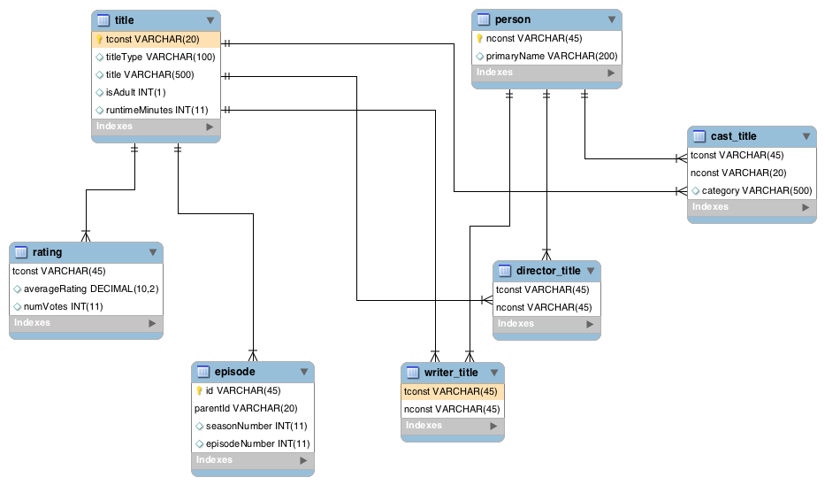

# Design

### EER Diagram  

# Setup Instructions

1. Download & Install mysql
2. On terminal execute `mysql -uroot -p` (enter your root mysql password) 
3. Use script init_database.sql to set up database schema. `source /Users/...{full_path}/init_database.sql`
4. clone project from [github](https://github.com/akhivesara/apis/tree/master/imdbservice) 
5. cd to project root, `cd imdbservice` and  `mvn clean package`
6. `cd target/package`
7. copy over config.properties to target/package `cp src/config.properties target/package`
8. Edit the config.properties to update `userbasepath` 
9. To populate database run: `java -Xms1024m -Xmx4096m -cp "imdbservice.jar:lib/*" com.imdb.DataUpdatingTool`
10. If you are running into errors in Step 9, you have 2 options
    1. Keep running the above command but to speed up,  do individual files, i.e either title, person, 
       episode, rating, genre, cast -by running: `java -Xms1024m -Xmx4096m -cp "imdbservice.jar:lib/*" com.imdb.DataUpdatingTool cast`
    2. Import database with data. Follow steps 2 & 3, but used  `init_database_with_data.sql` instead. Find it here [link](https://www.dropbox.com/sh/xdtm8vtbclgzhwm/AAB6p03kLweMC6GgE5dfQlcva?dl=0)            
11. To run the rest server: `java -cp "imdbservice.jar:lib/*" com.imdb.MainService`
12. You can now run try all of the below APIs

#### Approach:

# REST APIS SUPPORTED:
* NOTE: *The TRY links will work only if you complete all above steps*

### title/{id} 
***Rest API: To fetch title data***
##### Try : [Title](http://localhost:8080/nflxstudio/title/tt0000003)

---
### title/rating/{id}
***Rest API: To fetch title ratings***
##### Try : [Rating](http://localhost:8080/nflxstudio/title/rating/tt0164258)

---
### title/calculatedrating/{id}
***Rest API: To fetch title rating, on re-calculation. Algorithm used is: average of all episode ratings for that show***
##### Try : [New Rating](http://localhost:8080/nflxstudio/title/calculatedrating/tt0164258)

---
### title/cast/{id}
***Rest API: To fetch cast info for a title. Possible cast categories are PersonCategory***
##### Try : [Cast](http://localhost:8080/nflxstudio/title/cast/tt0164258)

---
### person/{id}
***Rest API: To fetch person data***
##### Try : [Person](http://localhost:8080/nflxstudio/title/nm5471631)

---

## All *list* rest apis accept limit and offset query params to support pagination

---
### lists/titles/adultTitles
***Rest API: To fetch a list of all adult titles on the service.***
##### Try : [Adult](http://localhost:8080/nflxstudio/lists/titles/adultTitles)

---
### lists/titles/type/{type}
***Rest API: To fetch a list of all titles of type. Possible values { short |movie |tvMovie |tvSeries |tvEpisode |tvShort |tvMiniSeries |tvSpecial |video |videoGame }***
##### Try : [tvSeries](http://localhost:8080/nflxstudio/lists/titles/type/tvSeries?limit=10&offset=0)

---
### lists/titles/genre/{genre}
***Rest API: To fetch a list of all titles of specified genre. Possible values for genre are { Documentary |Short |Animation |Comedy |Romance |Sport |News |Drama |Fantasy |Horror |Biography |Music |War |Crime |Western |Family |Adventure |History |Sci-Fi |Action |Mystery |Thriller |Musical |Film-Noir |Game-Show |Talk-Show |Reality-TV |Adult }***
##### Try : [Drama](http://localhost:8080/nflxstudio/lists/titles/genre/Drama?limit=10&offset=0)

---
### search/{query}
***Rest API: Search. Currently Supports Title and People. Implementation performs partial word match provided word begins with the query. Support filtering by query param type. if type=person returns only people, if type=title returns only title. default if no type returns both. limit: page size for pagination support. default is set at 100. offset: offset for pagination support***
##### Try : [Brad](http://localhost:8080/nflxstudio/search/brad?limit=10)

    "search": "brad",
    "title": {list:[...], ...},
    "people":{list:[...], ...},
    "timestamp": "01/07/2019 14:10:12.040"

---

### lists/titles/calculatedratings
***Rest API: To fetch a list of ratings for all titles that includes both ratings re-calculated and old ratings. Re-calculation Algorithm used is: average of all episode ratings for that show***
##### Try : [New Ratings](http://localhost:8080/nflxstudio/lists/titles/calculatedratings?limit=10)

---

# Java Docs
[Docs](docs/index.html)

# Gotcha
IMDB data integrity issues. Titles and People missing from the primary dataset. This leads to issues populating the DB, since we have foreign key relationship. 
DB could have been designed without foreign key relationship, but for the purpose if this exercise, we just drop the missing data.

### Future Work (due to time constraint) 

#### 1. API To Build:

### lists/titles/cast/{castId}
***Rest API: All titles a particular person has a role in***

---
### lists/titles/cast/role/{roleId}/{castId}
***Rest API: All titles a particular person has played a specific role***

---
### title/{id}/episodes
***Rest API: All episodes for a title***

---
### lists/genres
***Rest API: All Possible Genres***

---
### lists/types
***Rest API: All Possible Types***

---

#### 2. Better logger using tags, log levels

#### 3. Custom Response (decorated) objects, per resource, lists

#### 4. Bash script to create and populate db

#### 5. Abstract design so that any other database can be plugged in. So the remaining part is abstraction layer for MySQLStore. 
Here is how it could happen
MySQLStore will implement an IDatabaseImpl
IDatabaseImpl will have methods to populate, retrieve, delete, close connection, so forth
IMDBService, DataUpdatingTool will be instantiated with an instance of IDatabaseImpl. 
MySQLStore will be that instance in this project 
Now in theory, IMDBService can be instantiated by any other database implementation as well

#### 6. Optimized for Memory, CPU constraints during reading and populating database 

#### 7. Database performance leading to delay in API response times 

#### 8. Move business logic for ratings should be outside the MySQLStore, along with some cleanup
