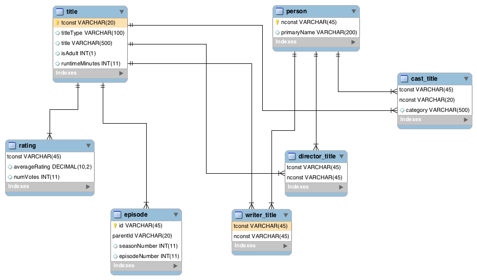

# Design

### EER Diagram  

# Database Setup Instructions 

#REST APIS SUPPORTED:

###title/{id} 
***Rest API: To fetch title data***

---
###title/rating/{id}
***Rest API: To fetch title ratings***

---
###title/calculatedrating{id}
***Rest API: To fetch title rating, on re-calculation. Algorithm used is: average of all episode ratings for that show***

---
###title/cast/{id}
***Rest API: To fetch cast info for a title. Possible cast categories are PersonCategory***

---
###person/{id}

***Rest API: To fetch person data***

---
---
##All *list* rest apis accept limit and offset query params to support pagination
---

###lists/calculatedRatings
***Rest API: To fetch a list of ratings for all titles that includes both ratings re-calculated and old ratings. Re-calculation Algorithm used is: average of all episode ratings for that show***

---
###lists/adultTitles
***Rest API: To fetch a list of all adult titles on the service.***

---
###lists/type/{type}
***Rest API: To fetch a list of all titles of type. Possible values { short |movie |tvMovie |tvSeries |tvEpisode |tvShort |tvMiniSeries |tvSpecial |video |videoGame }***

---
###lists/genre/{genre}
***Rest API: To fetch a list of all titles of specified genre. Possible values for genre are { Documentary |Short |Animation |Comedy |Romance |Sport |News |Drama |Fantasy |Horror |Biography |Music |War |Crime |Western |Family |Adventure |History |Sci-Fi |Action |Mystery |Thriller |Musical |Film-Noir |Game-Show |Talk-Show |Reality-TV |Adult }***

---
###search/{query}
***Rest API: Search. Currently Supports Title and People. Implementation performs partial word match provided word begins with the query. Support filtering by query param type. if type=person returns only people, if type=title returns only title. default if no type returns both. limit: page size for pagination support. default is set at 100. offset: offset for pagination support***

    "search": "brad",
    "title": {list:[...], ...},
    "people":{list:[...], ...},
    "timestamp": "01/07/2019 14:10:12.040"

---
###TODO STUBS:

###lists/genre/{genre}/{role}/{cast_id}
***Rest API: To fetch a list of all titles of a genre where a person is in a particular role/category (i.e director or actor, etc..)***

eg. lists/drama/Action/director/12345

---
###lists/type/{type}/{role}/{cast_id}
***Rest API: To fetch a list of all titles of a type where a person is in a particular role/category (i.e director or actor, etc..)***

eg. lists/drama/tvSeries/actor/12345

---
###lists/cast/{cast_id}
*** Rest API: All titles a particular person has a role in***

---